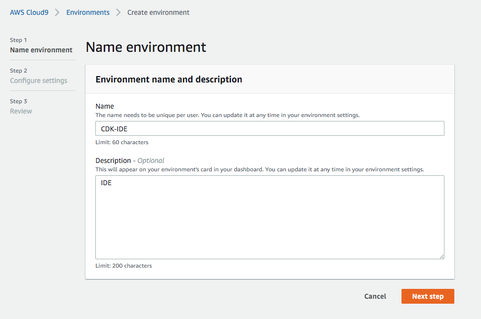
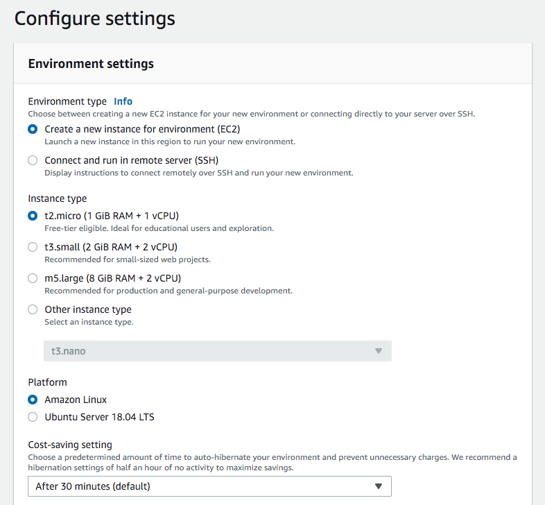
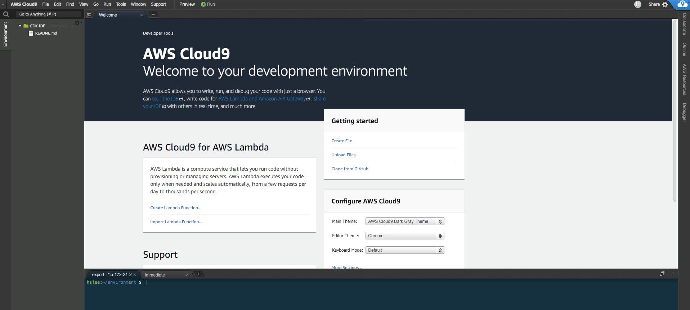
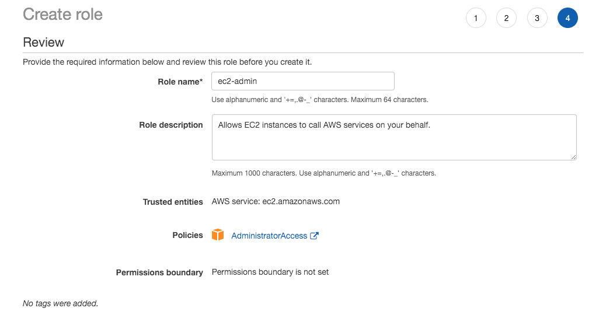
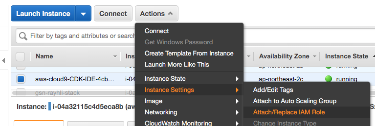
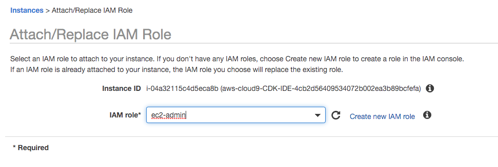
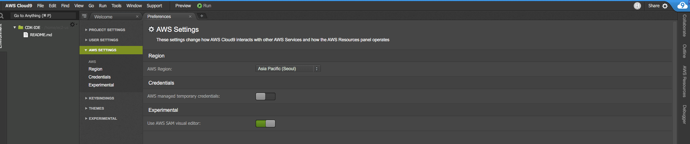
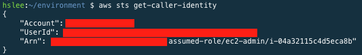

# AWS CDK(Cloud Development Kit) Sample Test


***Base Code:** https://github.com/aws-samples/aws-cdk-examples*


## 가정 사항

- Infrastructure as code에 대한 기본적인 지식을 가지고 있음
- AWS에 대한 기초적인 지식을 가지고 있음
- 리전 : Seoul (ap-northeast-2)
- 환경 : Cloud9


## 생성되는 인프라

- VPC (Virtual Private Cloud)
- Subnet
- NAT Gateway
- EC2 (with AutoScaling)
- ALB (Application Load Balancer)


## Cloud9 설정

### 1. IDE Name



### 2. Env Setup (나머지는 Default)




### 3. 동작 확인




## IAM Role

### 1. Create an IAM ROLE (For Cloud9)



### 2. Attach the IAM ROLE





### 3. Disable Managed temporary credential

#### Setting(톱니바퀴) -> AWS Setting -> AWS managed temporary credentials (OFF)



### 4. Set Own Profile (Cloud9 터미널 창에서 수행)

#### install jq(JSON Proceesor)

```bash
sudo yum install -y jq
```


#### remove any existing credential file

```bash
rm -vf ${HOME}/.aws/credentials
```


#### setting ID and REGION

```bash
export ACCOUNT_ID=$(aws sts get-caller-identity --output text --query Account)`   
export AWS_REGION=$(curl -s 169.254.169.254/latest/dynamic/instance-identity/document | jq -r '.region')  
```


#### check

```bash
test -n "$AWS_REGION" && echo AWS_REGION is "$AWS_REGION" || echo AWS_REGION is not set
```


#### save bash_profile

```bash
echo "export ACCOUNT_ID=${ACCOUNT_ID}" | tee -a ~/.bash_profile
echo "export AWS_REGION=${AWS_REGION}" | tee -a ~/.bash_profile
aws configure set default.region ${AWS_REGION}
aws configure get default.region
```


#### validation

```bash
aws sts get-caller-identity
```



- 본 계정의 Account Number 기록