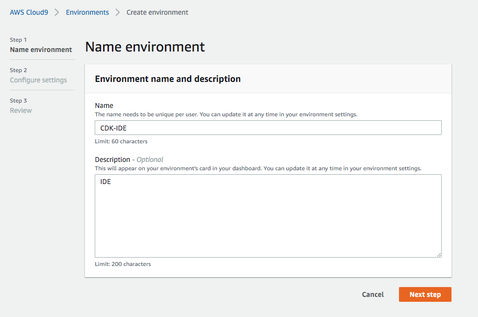
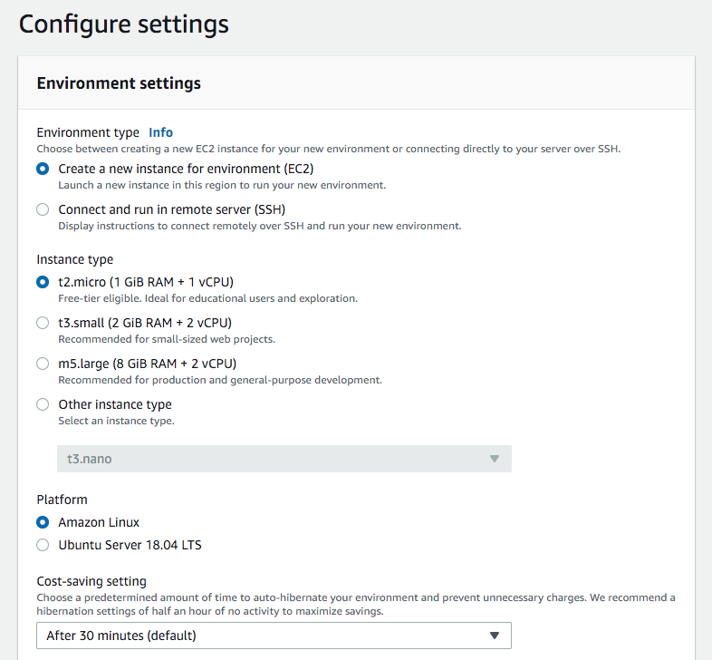
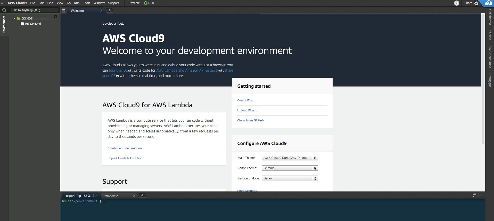
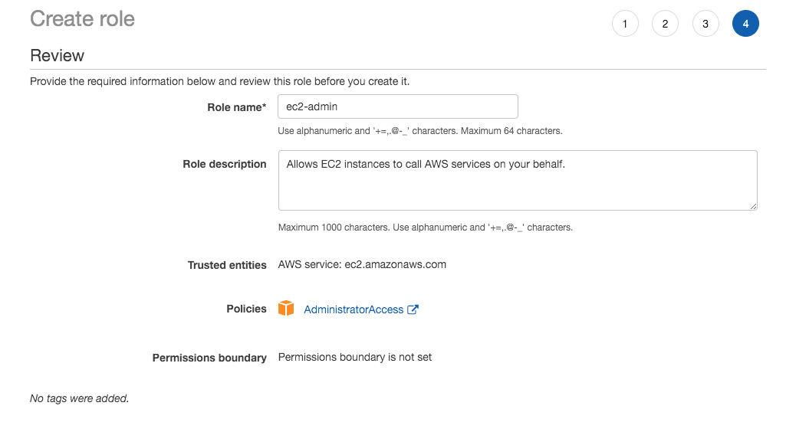
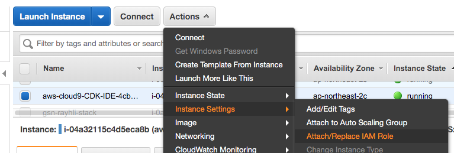
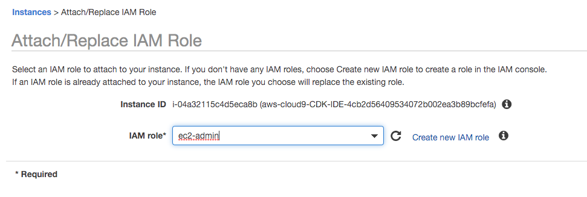
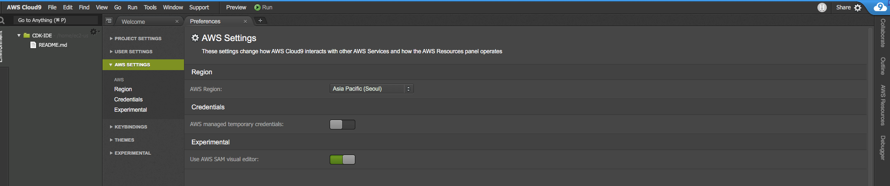
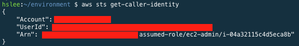

# AWS CDK(Cloud Development Kit) Sample Test

***Base Code:** https://github.com/aws-samples/aws-cdk-examples*


## 가정 사항

- Infrastructure as code에 대한 기본적인 지식을 가지고 있음
- AWS에 대한 기초적인 지식을 가지고 있음
- 리전 : Seoul (ap-northeast-2)
- 언어 : Python 3.x 
- 환경 : Cloud9


## 생성되는 인프라

- VPC (Virtual Private Cloud)
- Subnet
- NAT Gateway
- EC2 (with AutoScaling)
- ALB (Application Load Balancer)


## Cloud9 설정

### 1. IDE Name



### 2. Env Setup (나머지는 Default)




### 3. 동작 확인




## IAM Role

### 1. Create an IAM ROLE (For Cloud9)



### 2. Attach the IAM ROLE





### 3. Disable Managed temporary credential

#### Setting(톱니바퀴) -> AWS Setting -> AWS managed temporary credentials (OFF)



### 4. Set Own Profile (Cloud9 터미널 창에서 수행)

#### install jq(JSON Proceesor)

```bash
sudo yum install -y jq
```


#### remove any existing credential file

```bash
rm -vf ${HOME}/.aws/credentials
```


#### setting ID and REGION

```bash
export ACCOUNT_ID=$(aws sts get-caller-identity --output text --query Account)`   
export AWS_REGION=$(curl -s 169.254.169.254/latest/dynamic/instance-identity/document | jq -r '.region')  
```


#### check

```bash
test -n "$AWS_REGION" && echo AWS_REGION is "$AWS_REGION" || echo AWS_REGION is not set
```


#### save bash_profile

```bash
echo "export ACCOUNT_ID=${ACCOUNT_ID}" | tee -a ~/.bash_profile
echo "export AWS_REGION=${AWS_REGION}" | tee -a ~/.bash_profile
aws configure set default.region ${AWS_REGION}
aws configure get default.region
```


#### validation

```bash
aws sts get-caller-identity
```



본 계정의 Account Number 기록

## CDK(Cloud Development Kit) Deploy

*Directory PATH = `~/environment`*

### 1. Download Code

```bash
git clone https://github.com/toule/aws_cdk_basic_sample.git
```


### 2. Install CDK

```bash
npm install -g aws-cdk
```


### 3. Confirm Version

```bash
cdk --version
```


### 4. Install pip

```bash
curl -O https://bootstrap.pypa.io/get-pip.py
python3 get-pip.py --user
pip3 --version
```


### 5. Install CDK requirement

*Directory PATH = `~/environment/aws_cdk_basic_sample`*

```bash
pip3 install -r requirements.txt
```


### 6. CDK Stack List

```bash
cdk ls
```


### 7. Edit Account

*Directory File = `~/environment/aws_cdk_basic_sample/app.py`*

아래 스크립트의 경우 편의를 위해 최초 한번의 변수에 대해서 치환해주는 구문이므로 동작하지 않는 경우 my_account를 본인의 account id로 직접 변경 해야함

```bash
account=$(aws sts get-caller-identity | jq -r ".Account")
echo $account
sed -i `` "s/my_account/$account/g" app.py
```

 (* 여기에서 `은 **backtick**임)

```python
### Not Paste !!! ###
vpc_stack = SampleVPCStack(app, "Network", env=core.Environment(region="ap-northeast-2",account="my_account")) #Network is named ~/*/* (firsted named), it works based on this name.
ec2_stack = SampleEC2Stack(app, "Service", vpc=vpc_stack.vpc, env=core.Environment(region="ap-northeast-2",account="my_account"))
```


### 8. CDK Deploy

```bash
cdk deploy Network Service
```

Do you wish to deploy these changes (y/n)? y (enter)


### 8. 생성 완료

- 인프라가 제대로 생성되었는지 확인


## Destroy

`cdk destroy Network Service`

Are you sure you want to delete: Service, Network (y/n)? y (enter)

